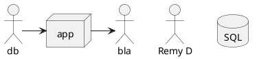

# PlantUML in Visual Studio Code

Follow [PlantUML - Visual Studio Marketplace](https://marketplace.visualstudio.com/items?itemName=jebbs.plantuml).

Online editor:

* [PlantText UML Editor](https://www.planttext.com/)

Types of UML:

* [Language specification pages](http://plantuml.com/sitemap-language-specification)

Example:

# How to convert a complex layout, exacty into PlantUML

See the process, original and result: [plantUML revisited - Docs-as-Code](https://docs-as-co.de/news/plantuml-revisited/)

See the code: [rdmueller.github.io/ActionFPS.puml](https://github.com/rdmueller/rdmueller.github.io/blob/master/images/ActionFPS.puml)

