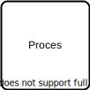
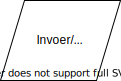
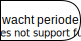
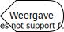

* Titel: Stroomdiagram
* Aanmaakdatum: 2020-08-17
* Voor: Iedereen
* Door: Amsterdam UMC, & Dion Dresschers
* Inspiratie: [[Guide to Flowchart Symbols, from Basic to Advanced | Gliffy](https://www.gliffy.com/blog/guide-to-flowchart-symbols)), en [draw.io](https://draw.io/)
* Licentie: [Creative Commons: CC BY-SA 4.0](https://creativecommons.org/licenses/by-sa/4.0/)
* Versie: 2020-08-17 09:37:07

# Wat is een flowchart.

Een flowchart is een grafisch overzicht van stappen, en beslissingen die genomen kunnen worden in een proces van begin tot eind. De flowchart wordt van boven naar beneden gelezen waar men altijd begint met een `start` en waar men eindigd met `eind`. Daartussen worden via pijlen aangegeven welke tussenstappen zoals `proces` en/of `keuze`. 

# Elementen

## Elementen - Start

Een ovaal geeft aan dat het de start is van een flowchart.

## Elementen - Einde

Een afgeronde rechthoek geeft aan dat het het einde is vand een flowchart

## Elementen - Proces

Een rechthoek is een stap in het proces, in deze stap worden er geen keuzes gemaakt.

## Elementen - Keuze

Een ruit geeft aan dat er een beslissing genomen moet worden. Achter de ruit zijn er een of meerdere opties die verder gaan naar onder of via een terugkoppeling weer naar boven gaan.

## Elementen - Data invoer & Uitvoer

Met een parallellogram wordt aangegeven dat er data toegevoegd of afgetapt wordt van de stroomdiagram.

## Elementen - Datasetopslag

Een 3D cylinder geeft aan dat er een dataset opgeslagen wordt in een database (of andersoortinge vorm).

## Elementen - Data opslag

Dit element geeft aan dat er data opgeslagen wordt. Dit kan dus ook een document zijn.

## Elementen - Handmatige invoer na vraag

Dit is het symbool dat er handmatige invoer gegeven moet worden na een geforceerde vraag van het systeem of proces. 

## Elementen - Extern proces

Dit symbool geeft aan dat er een proces is dat ergens ander (nog) wordt gedefinieerd. Dit proces wordt dus niet in detail beschreven in dit stroomdiagram.

## Elementen - Cloud

Dit symbool geeft aan dat er verder gegaan wordt naar een online omgeving.

## Elementen - Wacht periode

Dit element geeft aan dat er een bepaalde tijd gewacht moet worden.

## Elementen - Document

Met dit symbool wordt aangegeven dat een extern document erbij gehaald moet worden of een documenten gegenereerd wordt.

## Elementen - Meerdere documenten

Dit symbool geeft aan dat er meerdere documenten zijn

## Elementen - Weergave

Dit element geeft aan dat er data op een scherm wordt weergegeven.

## Elementen - Samenvoeging

Dit geeft aan dat er twee of meerdere datastromen samen komen.

## Elementen - Handmatige actie

Dit geeft aan dat er een handmatige actie uitgevoerd moet worden.

## Elementen - Lus

Dit geeft aan dat het een begin of het einde is van een lus.

## Elementen - Sortering

Deze geeft aan dat er een sortering plaats vindt.

## Elementen - Data samenvoegen en verwerken

## Elementen - Referentie andere pagina

Dit element geeft aan dat de stoomdiagram verder gaat op een andere pagina. 

Je begint op die andere pagina met hetzelfde teken. Het is handig om te referen naar het document vanaf waar verder gegaan wordt, of verder naar gegeaan wordt.

## Elementen - Referentie zelfde pagina 

Dit element geeft aan dat de stroomdiagram verder gaat op dezelfde pagina op een ander punt. 

Je begint dan weer met hetzelfde teken. 

## Elementen - Kaart

Dit geeft aan dat er een kaart gebruikt wordt.

## Elementen - Pijlen

Na een element, behalve bij het `einde` volgt een pijl die gevolgd kan of moet worden. Er zijn vele soorten, maar kies voor een simpel diagram voor een soort pijl met een lijn die niet onderbroken is.

## Elementen - Voorbereiding

Dit geeft aan dat er een voorbereiding gedaan moet worden voor iets anders

## Elementen - Annotatie

De annotatie geeft aan dat er extra beschrijvende tekst toegevoegd kan worden

## Elemetnen - Transformatie

Een dikke pijl (anders dan de pijlen tussen elementen) geeft aan dat er een bepaald soort transformatie plaats vindt. Dit kan dus van de ene datasoort zijn naar een andere datasoort of van een opdracht naar een (al dan niet fysiek) product.

