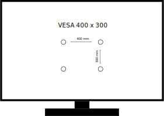

# Titel 

* Doelgroep: Iedereen
* Licentie: [Creative Commons — CC BY-SA 4.0](https://creativecommons.org/licenses/by-sa/4.0/)
* Datum: 2020-10-26
* Status: Definitief
* Revisie: Jaarlijks
* Auteur: Dion Dresschers
* Inspiratie: [VESA Mounting Standard | One For All](https://www.oneforall.co.uk/explore/vesa-mounting-standard#/step-1)
* Bestandslocatie: [github - diondresschers - samenvattingen](https://github.com/diondresschers/samenvattingen/blob/master/vesa/vesa.md)
* Versie: 2020-10-26 10:24:14

# VESA formaten

VESA is een standaard voor computer schermen standaarden van de Video Electronic Standards Assosiation (VESA) [vesa.org][https://vesa.org/).

# Voorbeeld

# Formaten

* VESA 75 x 75
* VESA 100 x 100
* VESA 200 x 100
* VESA 200 x 200
* VESA 300 x 200
* VESA 300 x 300
* VESA 400 x 200
* VESA 400 x 300
* VESA 400 x 400
* VESA 600 x 400
* VESA 800 x 600
